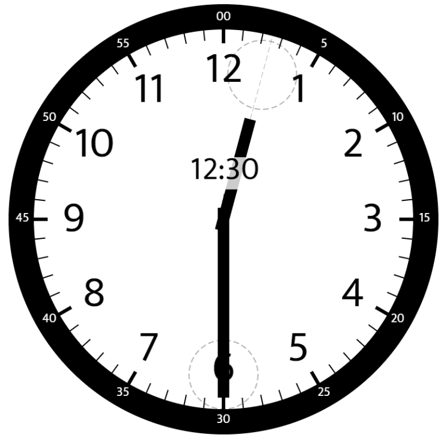
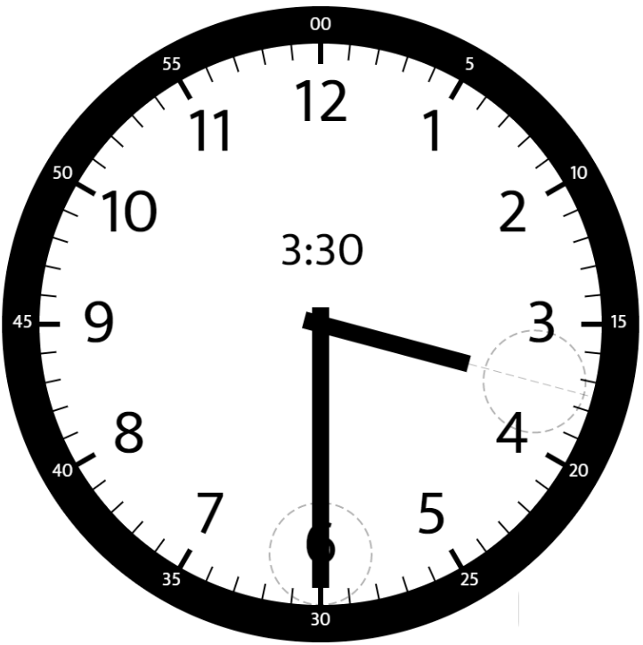

# Leetcode 1344: Angle Between Hands of a Clock
## Date: 2026-June-17

**`Question`**

Given two numbers, hour and minutes, return the smaller angle (in degrees) formed between the `hour` and the `minute` hand.

Answers within 10-5 of the actual value will be accepted as correct.

**`Examples`**



Input: hour = 12, minutes = 30
Output: 165



Input: hour = 3, minutes = 30
Output: 75

**`Notes`**
- Know how to convert `int` to `double` in division.
- Know For normal case, just get abs value between hour hand to 12 pos and min hand to 12 pos on clock.
- Know for edge case like `1:57`, need to compare with `360-HourAndMinHandAngle` to get the min.

**`Solution`**

```csharp
public class Solution {
    public double AngleClock(int hour, int minutes) {
        var hourAngleTo12 = (hour * 30 + (double) minutes * 30 / 60) % 360;
        var minAngleTo12 = minutes * 6;

        var hourAndMinAngle = Math.Abs(hourAngleTo12 - minAngleTo12);

        return Math.Min(hourAndMinAngle, 360-hourAndMinAngle);
    }
}
```